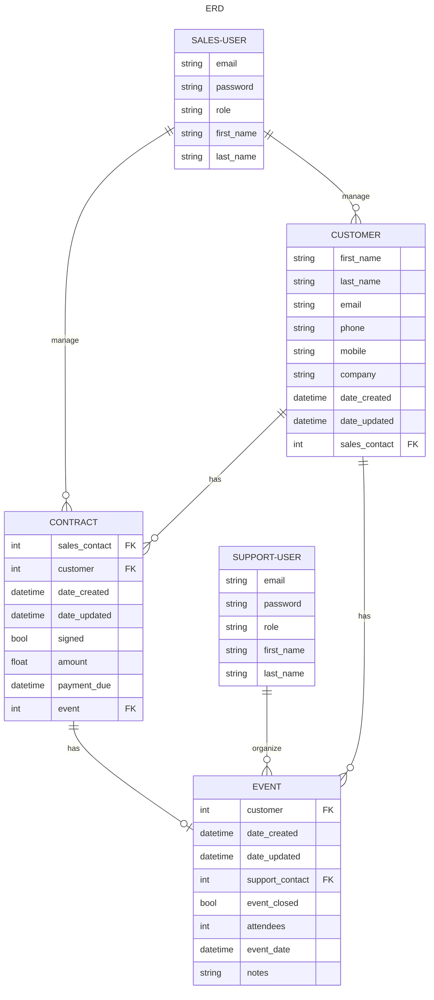

# Epic-Events-CRM

The API allows you to manage a CRM system for an event company.

The admin uses the admin page as the management tool to create sales_user and support_user.

Sales users can create customers and create contract attached to those customers. When a contract is signed, the sales user set the contract to the signed status and assign a support user to manage the event.

The event is automatically created when the contract is signed.

Once the support user is done with the event, he can set the status "finished" to the event.

## Quick start

- The admin must create an account for the different users.
- Login to get your access token (POST /login/)
- Create a customer as a sales user (POST /customer/)
- Add a contract as a sales user (POST /customer/id/contract/)
- Create the event by signed the contract and assign a support user (/customer/id/contract/)
- Manage the event as the support user (/customer/id/contract/id/event/)

A search feature is available for customer, contract and event :

```
/customer?email=test@example.com
```
also work for last_name

```
/contract?email=test@example.com
```
also work for last_name, date, amount

```
/event?email=test@example.com
```
also work for last_name and date

Sales user can modify the customer and contract and support user can modify the events.

Documentation of the API : https://documenter.getpostman.com/view/25179277/2s93CGRFmy


